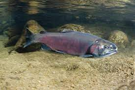
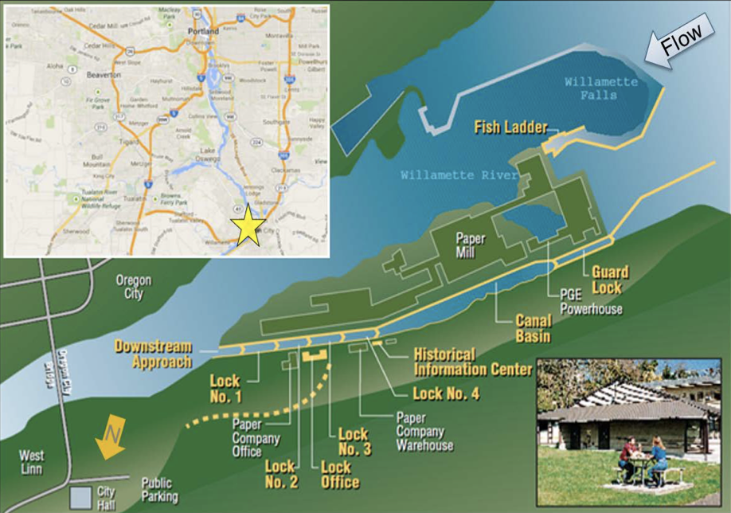

### Overview



Data is provided from the Columbia River Data Access in Real Time (DART) and shows adult fish passage data from 2001-01-01 to 2010-12-31 at the Willamette Falls fish ladder on the Willamette River (Oregon). Populated variables include project, date, temperature in degrees celsius, and the number of chinook, jack chinook, steelhead, coho, and jack coho salmon. This report analyzes salmon data by looking at the time series information as a whole, by season, and by year. Coho salmon, jack coho salmon, and steelheads are assessed.



**Data citation:** 
Columbia River Basin Data Access in Real Time (DART). DART Adult Passage Graphics and Text. Accessed on March 3, 2022. http://www.cbr.washington.edu/dart/query/adult_graph_text


```{r setup, include=FALSE}
knitr::opts_chunk$set(echo = TRUE, warning = FALSE, message = FALSE)

library(tidyverse)
library(here)
library(magrittr)  # for using the pipe
library(janitor)
library(lubridate)
library(tsibble)
library(feasts)
library(slider)
library(patchwork)
library(ggpubr)
```


```{r}
# Read in the data
fish <- read_csv(here("data", "willamette_fish_passage.csv")) %>%
  clean_names() %>% 
  select(project, date, steelhead, coho, jack_coho, temp_c) %>% 
  mutate_all(~replace(., is.na(.), 0)) %>% 
  mutate(date = lubridate::mdy(date))

fish_ts <- fish %>% 
  as_tsibble(key = NULL, index = date)
```

## Willamette Falls Fish Passage Time Series Summary {.tabset .tabset-fade}

### Original Time Series
```{r}
fish_orig <- fish_ts %>% 
    pivot_longer(cols = c(coho, jack_coho, steelhead), names_to = "species", values_to = "count")

p1 <- ggplot(data = fish_orig, aes(x = date, y = count), color = species) +
  geom_line(aes(color = species)) +
  theme_minimal() +
  labs(x = "Date",
       y = "Number of Salmon",
       col = "Species")
p1
```

**Figure 1.** Number of coho, jack coho, and steelhead salmon passing through the Willamette Falls fish ladder between January 1, 2001 and December 31, 2010.

- Steelhead passage numbers appear to have a consistent cyclical pattern throughout the entire time series.

- Coho salmon increase their passage numbers towards the end of the time series.

- Jack coho salmon are counted in fewer numbers than coho and steelhead salmon almost every year.


### Seasonplots

```{r}
# Coho
coho_month <- fish_ts %>% 
  index_by(yr_mo = ~yearmonth(.)) %>% # groups by index value
  summarize(coho_month_count = sum(coho))

p4 <- coho_month %>% 
  gg_season(y = coho_month_count) + 
  theme_minimal() +
  ggtitle("Seasonal Trends of Coho Data") +
  labs(x = "Month",
       y = "Number of \n Coho \nSalmon",
       col = "Year")


# Jack Coho
jack_coho_month <- fish_ts %>% 
  index_by(yr_mo = ~yearmonth(.)) %>% # groups by index value
  summarize(jack_coho_month_count = sum(jack_coho))

p5 <- jack_coho_month %>% 
  gg_season(y = jack_coho_month_count) + 
  theme_minimal() +
  ggtitle("Seasonal Trends of Jack Coho Data") +
  labs(x = "Month",
       y = "Number of \n Jack Coho \nSalmon",
       col = "Year")

# Steelhead
steelhead_month <- fish_ts %>% 
  index_by(yr_mo = ~yearmonth(.)) %>% # groups by index value
  summarize(steelhead_month_count = sum(steelhead)) %>% 
  mutate(year = year(yr_mo))

p6 <- steelhead_month %>% 
  gg_season(y = steelhead_month_count) + 
  theme_minimal() +
  ggtitle("Seasonal Trends of Steelhead Data") +
  labs(x = "Month",
       y = "Number of \n Steelhead \nSalmon",
       col = "Year")

ggarrange(p4, p5, p6, ncol = 1, common.legend = TRUE, legend = "right")
```

**Figure 2.** Seasonplot. Number of coho, jack coho, and steelhead salmon passing through the Willamette Falls fish ladder each month between January 1, 2001 and December 31, 2010.

- Most steelhead salmon are observed earlier in the year (March-June).

- Most coho and jack coho salmon are observed from August to November.

- Jack coho salmon range from about 0-1500 individuals - a much lower range than either steelhead or coho salmon.


### Annual Counts by Species 

```{r}
fish_annual <- fish_orig %>% 
  index_by(yearly = ~year(.)) %>% 
  group_by(species) %>% 
  summarize(total_species = sum(count))

ggplot(data = fish_annual, aes(x = yearly, y = total_species)) +
  geom_line(aes(color = species)) + 
  theme_minimal()+
  ggtitle("                              Yearly Total for Each Species") +
  labs(x = "Year",
       y = "Total Number of Salmon", 
       col = "Species") + 
  scale_x_continuous(breaks = c(2002, 2004, 2006, 2008, 2010))

### define manually - scale_x_disc or continuous
```

**Figure 3.** Annual total counts by species between January 1, 2001 and December 31, 2010.

- Steelhead salmon are observed with the highest counts among all species every year, except 2009.

- Jack coho salmon consistently have the fewest individuals of the three salmon species passing through the fish ladder.

- Coho salmon exhibit relatively consistent counts each year until 2008 when the total number has a large increase.


##